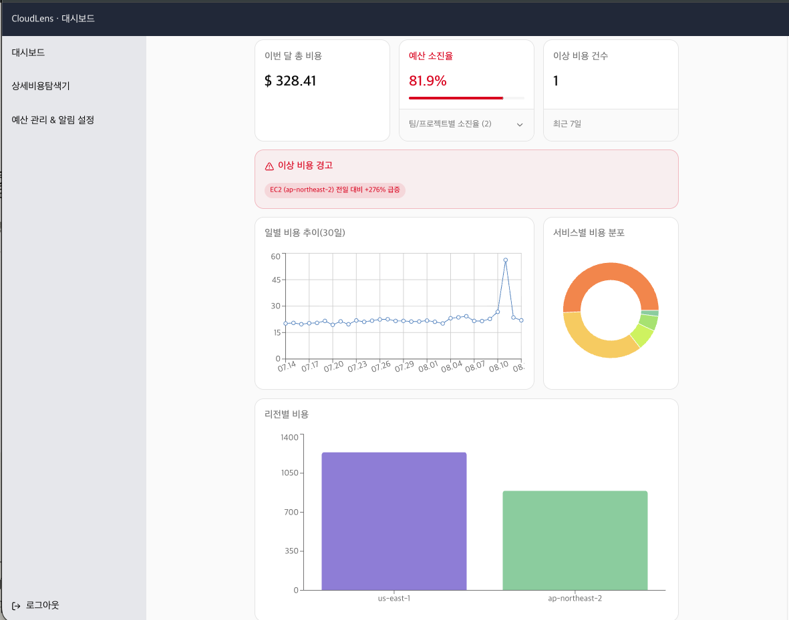
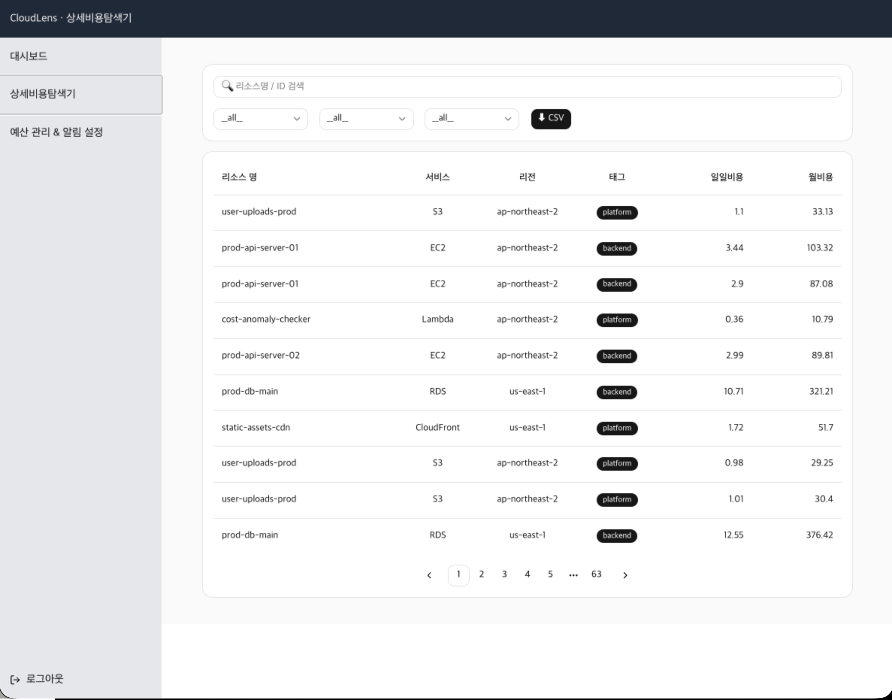
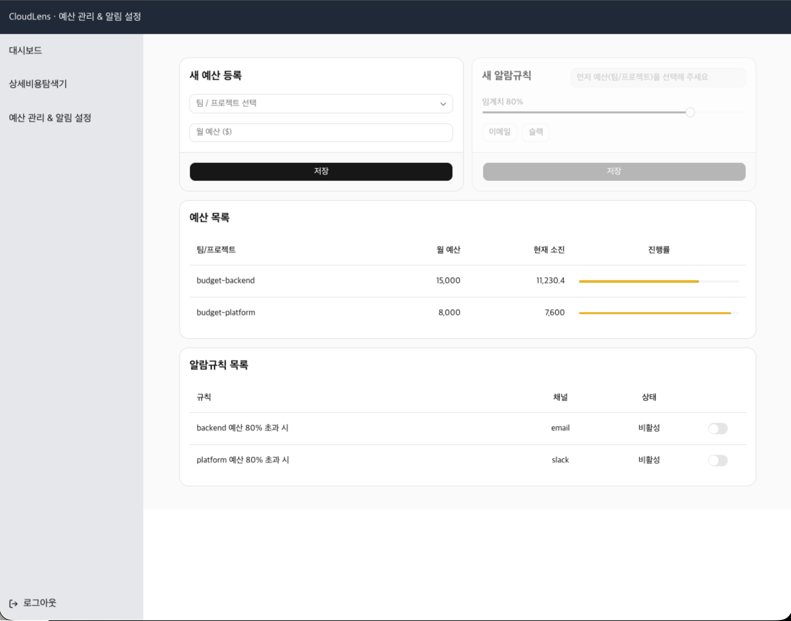

# CloudLens

AWS 비용을 시각화하고 예산 초과·이상 비용을 감지하는 비용 모니터링 대시보드입니다. Next.js(App Router)와 Supabase로 4주간 혼자 만든 포트폴리오 프로젝트입니다.

**Live Demo**: https://cloud-lens-flax.vercel.app/
테스트 계정: `admin@admin.com` / `admin1234`

---

| 대시보드                         | 상세 비용 탐색기                 | 예산 관리 & 알림 설정               |
| -------------------------------- | -------------------------------- | ----------------------------------- |
|  |  |  |

## 무엇을 만들었나

| 페이지                | 기능                                                                                             |
| --------------------- | ------------------------------------------------------------------------------------------------ |
| 대시보드              | 이번 달 총비용, 예산 소진율, 이상 비용 건수, 일별 비용 추이 / 서비스별·리전별 비용 분포 차트     |
| 상세 비용 탐색기      | 리소스별 비용 테이블 — 검색, 서비스/리전/태그 필터, 정렬, 페이지네이션                           |
| 예산 관리 & 알림 설정 | 팀/프로젝트별 예산 등록, 소진율 진행바(임계치 근접 시 경고색), 알림 규칙(이메일/Slack) 등록·수정 |

## 기술 스택

- **프레임워크**: Next.js 16(App Router), TypeScript, React 19
- **스타일링**: Tailwind CSS 4 + shadcn/ui, `@base-ui/react`
- **차트**: Recharts
- **데이터 테이블**: TanStack Table
- **서버 상태 관리**: TanStack Query
- **폼 & 검증**: react-hook-form + zod
- **데이터 레이어**: Supabase(Auth + PostgreSQL), RLS 정책, PL/pgSQL RPC 함수
- **배포**: Vercel

## 도메인 로직

### 이상 비용 감지 — 이동평균 기반 Z-score

이상 비용 판단은 Supabase SQL 함수(RPC) 하나로 처리합니다.

```sql
avg(daily_cost) over (
  partition by service, region
  order by cost_date
  rows between 7 preceding and 1 preceding
) as avg_7d,
stddev(daily_cost) over (
  partition by service, region
  order by cost_date
  rows between 7 preceding and 1 preceding
) as stddev_7d
...
where (daily_cost > (avg_7d + 3 * coalesce(stddev_7d, 1)) and daily_cost > 10)
```

서비스·리전별로 **직전 7일(오늘 제외) 슬라이딩 윈도우**의 평균·표준편차를 매일 다시 계산하고, 오늘 값이 그 **이동평균 + 3×이동표준편차**를 넘으면 이상치로 판단합니다.

이 SQL을 짤 때 IQR(사분위수 기반) 방식과 비교했습니다.

| 항목          | Z-score (이동평균 + 3×이동표준편차)                  | IQR (Q3 + 1.5×IQR)               |
| ------------- | ---------------------------------------------------- | -------------------------------- |
| 계산 기준     | 슬라이딩 윈도우의 평균과 표준편차                    | 1사분위수(Q1), 3사분위수(Q3)     |
| 정규분포 가정 | 있음                                                 | 없음                             |
| 극단치 영향   | 평균·표준편차가 극단치에 끌려가기 쉬움               | 상대적으로 덜 받음               |
| 적합한 환경   | 분포가 정규분포에 가깝고 기준값을 검증하기 쉬운 환경 | 이상치가 이미 섞인 실데이터 환경 |

### 예산 경고

- 예산의 80% 소진 시 경고색으로 전환 (`lib/budget.ts`)
- 알림 규칙이 활성화된 예산은 진행률 슬라이더가 빨간색, 임계치까지 20%p 이내로 근접하면 노란색으로 표시

## 트러블슈팅

### 1. 알람 규칙을 토글해도 화면이 안 바뀌는 문제

- **Situation**: 알람 규칙 목록에서 활성/비활성 스위치를 눌렀는데, API 호출은 200으로 성공하는데도 화면의 상태 표시가 그대로였다.
- **Task**: 네트워크 요청은 정상인데 화면만 갱신 안 되는 원인을 찾아 실시간으로 반영되게 고쳐야 했다.
- **Action**: TanStack Query의 캐시 구조를 다시 짚었다. mutation이 무효화(`invalidateQueries`)하는 쿼리 키(`ruleList`)와 실제 화면이 읽는 쿼리 키(`ruleData`)가 이름부터 다르다는 걸 확인하고 두 이름을 일치시켰다.
- **Result**: 토글, 추가, 수정 등 모든 CRUD 작업이 API 성공과 동시에 화면에 즉시 반영되도록 고쳤다.

### 2. 데이터가 바뀔 때마다 테이블 레이아웃이 흔들리는 문제

- **Situation**: 알람 상태가 "활성"↔"비활성"으로 바뀌거나 슬라이더 값이 갱신될 때마다 테이블 전체 폭이 미세하게 재계산되면서 화면이 흔들렸다.
- **Task**: 데이터가 바뀌어도 테이블 레이아웃이 고정되도록 만들어야 했다.
- **Action**: `table-layout`을 지정하지 않아 브라우저가 셀 콘텐츠 길이에 따라 열 너비를 매번 다시 계산하고 있음을 확인했다. `table-layout: fixed`를 적용하고 각 컬럼에 고정 너비(`size`)를 명시했다.
- **Result**: 값이 바뀌어도 테이블 폭이 흔들리지 않게 됐다. 같은 원인으로 세로 스크롤바가 불필요하게 뜨던 문제도 함께 해결했다.

### 3. 설정값과 실측값을 혼동한 표시 버그

- **Situation**: 예산 목록의 진행률 슬라이더가 실제 소진율과 무관하게 항상 똑같은 위치에 멈춰 있는 것처럼 보였다.
- **Task**: 슬라이더가 "현재 얼마나 썼는지(실측값)"를 정확히 반영하도록 고쳐야 했다.
- **Action**: 슬라이더가 `current_spend / monthly_limit`(실제 소진율)이 아니라 `threshold_percent`(사용자가 설정한 경고 기준값)를 그대로 그리고 있었다. 필드 이름이 비슷해 혼동한 것으로 보고, 실제 소진율을 계산하는 함수로 교체했다.
- **Result**: 슬라이더가 실제 지출 대비 소진율을 정확히 표시하게 됐다.

## 개발 과정과 AI 활용

Supabase 스키마 설계, 인증(auth) 구현, RPC용 SQL문은 AI(Claude Code) 도움을 받았습니다.
반면 PostgREST 쿼리 빌더로 테이블을 직접 조회하는 부분과, 프론트엔드의 GET/POST 로직(컴포넌트, 훅, mutation)은 직접 짰습니다.

- [CloudLens 마무리 회고](https://creator41360.tistory.com/65)

## 로컬 실행

```bash
npm install
cp .env.local.example .env.local  # NEXT_PUBLIC_SUPABASE_URL, NEXT_PUBLIC_SUPABASE_ANON_KEY, SUPABASE_SERVICE_ROLE_KEY 채우기
npx tsx scripts/seed.ts           # 더미 비용 데이터 시딩 (upsert 기반, 반복 실행 안전)
npm run dev
```
